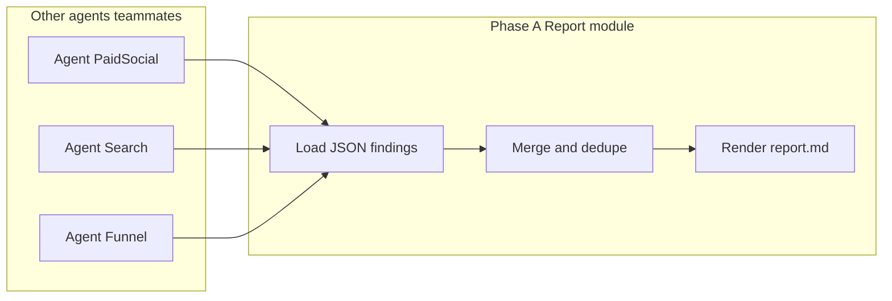

# Daytona marketing analysis (split: report generation first)

## Context

The repo is effectively empty today ([README.md](README.md) only). You chose **Python** and **mock APIs** for the full vision; **this iteration focuses only on synthesizing a report from findings** that other agents (or teammates) will produce.

## Phased ownership

**Phase A — Report generator (this track):** Input = one or more **structured finding documents** (JSON). Output = **`report.md`** (and optionally intermediate `merged.json`). No Daytona required to build or test this piece.

**Phase B — Agent workers (other track):** Sandboxes + mock APIs emit JSON that conforms to the same schema. The orchestrator (or a shell script) passes those files into Phase A.

## Input contract (critical for split work)

Define a single **`AgentFinding`** (name flexible) model that every producer must output, e.g.:

- **`agent_id` / `source_role`**: e.g. `paid_social`, `paid_search`, `funnel`
- **`period` / `as_of`**: optional but helps narrative consistency
- **`headline`**: one-line takeaway
- **`metrics`**: list of `{name, value, unit?, delta?, benchmark?}` (keep generic; string or number values OK with typing rules)
- **`recommendations`**: list of `{title, rationale, impact_estimate?, effort?, priority?}`
- **`evidence` / `citations`**: optional bullet strings or structured refs (no need for real URLs in v1)
- **`confidence`**: enum or 0–1 for merge ordering
- **`raw_notes`**: optional longer text for LLM consumption only

Publish **`examples/fixtures/`** with 3–4 JSON files so teammates can validate their agents without your code.

## Merge / “lead analyst” logic (deterministic first)

- **Normalize** each finding (validate with Pydantic).
- **Dedupe recommendations**: fuzzy match on normalized `title` (simple: lowercase strip; upgrade later if needed).
- **Sort**: by `priority` then `impact_estimate` then `confidence`.
- **Executive roll-up**: aggregate metrics where `name` matches across agents (sum spend, weighted averages only where explicitly defined—avoid bogus math; prefer “report side by side” over fake consolidation).
- **Optional LLM pass**: single call that receives `MergedReport` JSON + optional `raw_notes`; returns only polished prose for fixed sections (strict system prompt, no new numbers). Behind `--llm` and `OPENAI_API_KEY`.

## Rendering

- **Jinja2** templates: `executive_summary.md.j2`, `channel_sections.md.j2`, `recommendations.md.j2` composed into one file.
- **Non-LLM path** must produce a **credible report** from templates alone so the hackathon works offline.

## Repository layout (report-first slice)

- `report_gen/` — package: `models.py`, `merge.py`, `render.py`, `cli.py`
- `templates/` — Jinja2 templates
- `examples/fixtures/` — sample `*.finding.json` files
- `pyproject.toml` — deps: `pydantic`, `jinja2`, optional `openai`

Later, teammates add `orchestrator/`, `mock_api/`, `worker/` without renaming your models if the contract is stable.

## Phase B reminder (unchanged intent, deferred)

- Daytona sandboxes per channel worker; mock FastAPI; snapshot; parallel `create`/`execute`; write **the same JSON** your report module already accepts.

## Demo for Phase A only

1. Drop or generate fixture JSON files.
2. Run `report-gen --inputs ... --out report.md`.
3. Show `report.md` structure and explain that live agents will replace fixtures.

## Risks (Phase A)

- **Schema drift**: Mitigate with **version field** on each finding (`schema_version: 1`) and clear examples.
- **Conflicting recommendations**: Deterministic dedupe + “see also” grouping in template beats silent drops.

## Implementation order (this track)

1. Pydantic models + JSON fixtures.
2. Merge function + unit tests on dedupe/sort.
3. Jinja templates → `report.md`.
4. CLI + README contract for teammates.
5. Optional LLM polish flag.